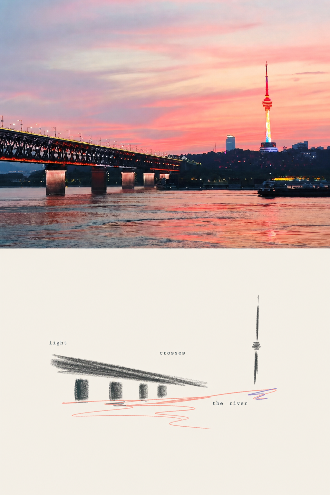
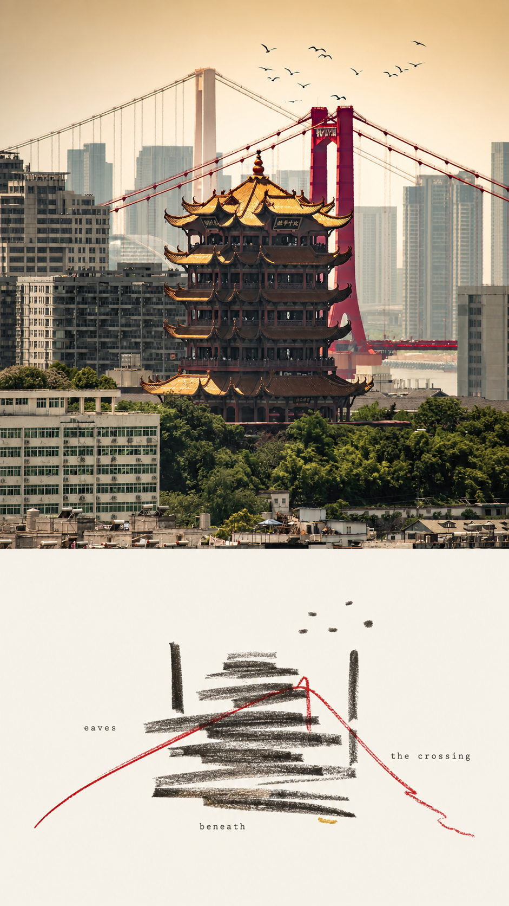
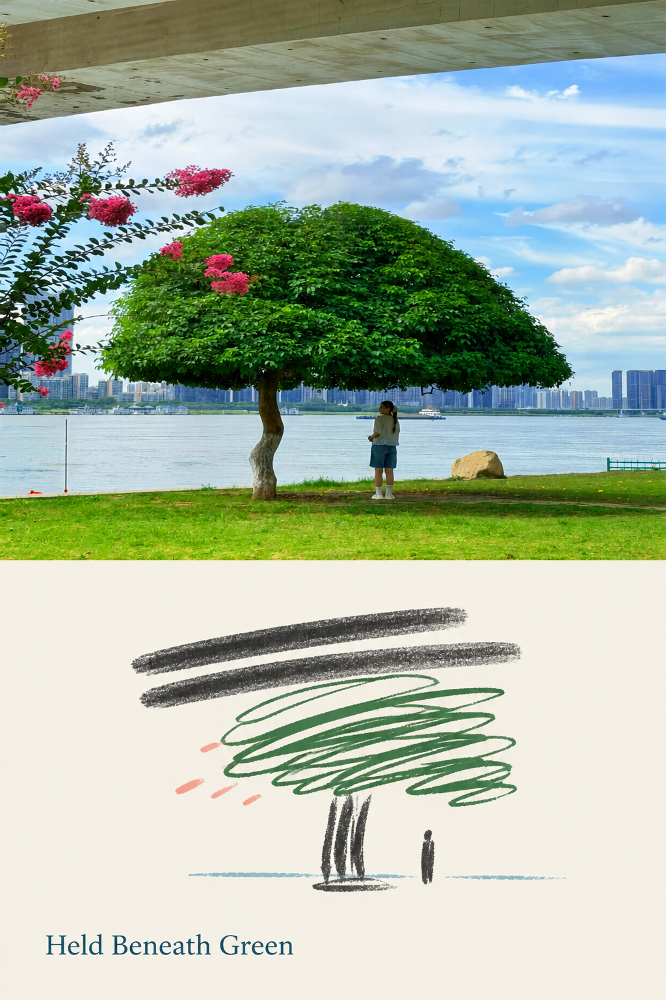
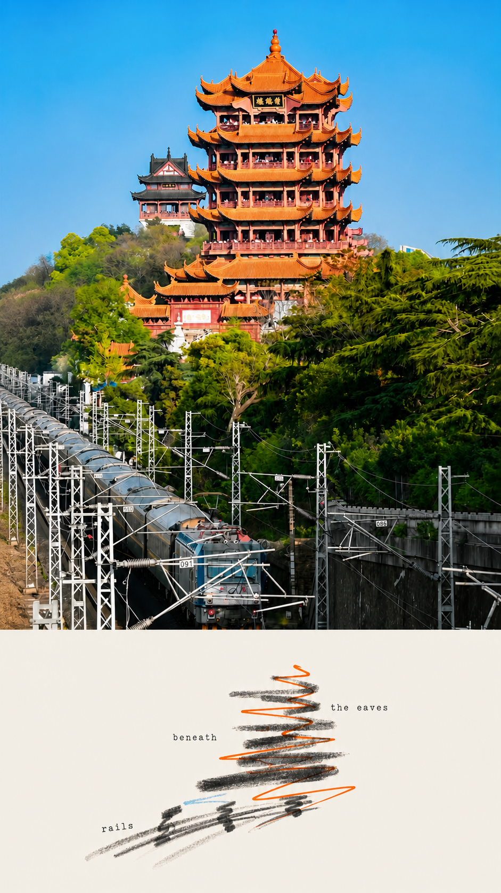
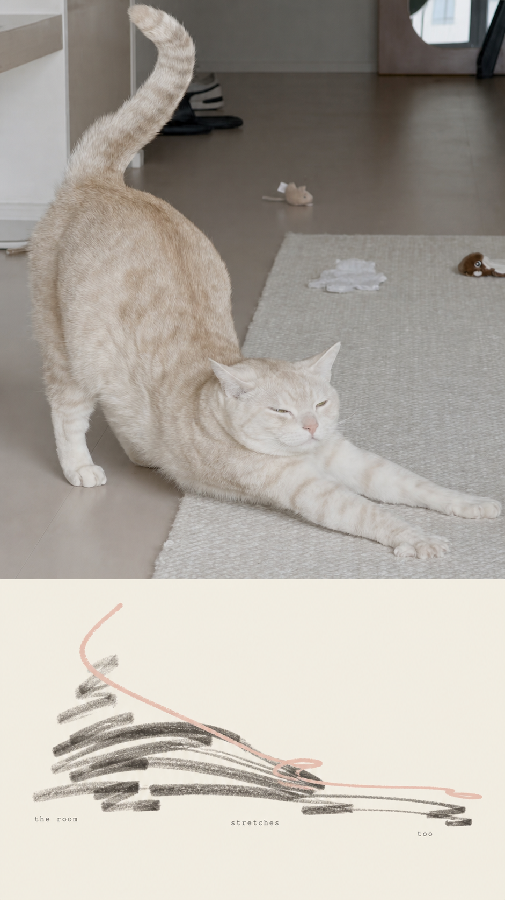
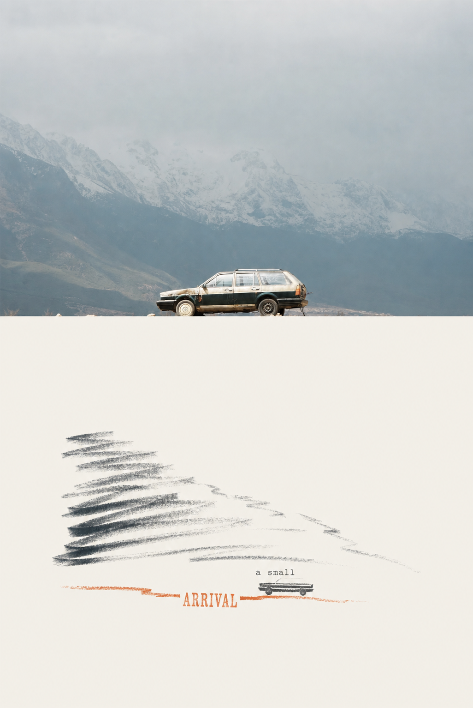

# Poetic Line Zine Poster

把一张照片做成一页克制的摄影 zine：上方保留原始照片，下方用炭笔扫线、连续彩色涂鸦和小尺度实验文字，重组照片里的方向、距离、节奏与留白。

[](./SKILL.md)
[](./references/poetic-line-editorial-prompt.zh-CN.md)

## 效果预览

<p align="center">
  
  
  
</p>

<p align="center">
  
  
  
</p>

## 它会生成什么

每次调用只输出一张完整作品，画面由三个部分组成：

1. **忠实摄影区**：保留上传照片的主体、光线、颜色和空间关系，只允许等比缩放与轻微裁切。
2. **抽象记忆面板**：从原图提取少量关键关系，用宽炭笔扫线和一条连续彩色涂鸦重构。
3. **诗意英文标题**：使用 2 至 5 个词，标题参与构图，不充当普通海报说明。

Skill 不会把整张照片变成素描，也不会在照片上叠加滤镜。摄影区和抽象区承担不同任务。

## v2 改进

- **两阶段生成**：图像模型只生成无文字抽象面板，脚本负责拼入原始照片与标题。
- **三档抽象强度**：`restrained`、`balanced`、`expressive` 控制笔触数量和辨识程度。
- **四类题材路由**：`gesture`、`mass`、`rhythm`、`path` 分别处理姿势、体量、重复和路径。
- **确定性输出**：脚本固定照片占比、标题拼写和最终画幅。
- **自动验收**：检查宽高比、摄影区像素忠实度和面板角落。
- **回归评分**：用固定照片集比较每次规则调整，75 分作为通过线。

## 视觉语言

### Charcoal Sweep

炭笔侧锋负责主体质量和结构轴线。笔触保留钝头、断裂、压力变化和拖尾，并用象牙色空隙切出内部亮部。人物、动物、建筑和植物都压缩为少量方向性扫线。

### Chromatic Scribble

一条连续或近似连续的彩色线负责路径、倒影、风、花朵、灯光或运动回声。线条会交叉、停顿和收紧，颜色来自原照片；用户也可以指定一种额外强调色。

### Experimental Typography

标题使用小号衬线、打字机字或等宽字，并从四种模式中选择一种：

- Edge-Pressed Serif
- Fragmented Typewriter
- Letterpress Emphasis
- Ghost Text

文字会贴边、跨越间隙、悬挂在横线下或沿源照片的轴线分布。每个单词只出现一次。

## 安装

克隆到 Codex Skills 目录：

```powershell
git clone https://github.com/zhu930824/poetic-line-zine-poster.git "$env:USERPROFILE\.codex\skills\poetic-line-zine-poster"
```

重新打开 Codex，然后通过 `$poetic-line-zine-poster` 调用。

已有安装可以这样更新：

```powershell
Set-Location "$env:USERPROFILE\.codex\skills\poetic-line-zine-poster"
git pull
```

确定性拼版脚本依赖 Pillow：

```powershell
python -m pip install -r requirements.txt
```

## 快速使用

上传一张照片，然后输入：

```text
使用 $poetic-line-zine-poster 处理这张照片。
```

输出严格的 9:16：

```text
使用 $poetic-line-zine-poster 处理这张照片。输出 9:16。
```

指定一种强调色：

```text
使用 $poetic-line-zine-poster 处理这张照片，用几笔钴蓝色线条点缀。
```

强调抽象程度：

```text
使用 $poetic-line-zine-poster 处理这张照片。使用 restrained 抽象强度，保留姿势和方向。
```

让标题更安静：

```text
使用 $poetic-line-zine-poster 处理这张照片。标题使用低对比 Ghost Text，保持小字和大面积留白。
```

## 可控项

| 控制项 | 写法示例 | 作用 |
|---|---|---|
| 画幅 | `输出 9:16` | 指定最终宽高比；生成后应校验像素尺寸 |
| 强调色 | `用钴蓝色点缀` | 允许一种照片外颜色 |
| 抽象程度 | `使用 restrained` | 在 `restrained`、`balanced`、`expressive` 中选择 |
| 题材路由 | `使用 gesture + path` | 指定姿势与运动路径的提炼方法 |
| 标题语气 | `标题更安静` | 调整文字对比度、字号和空间位置 |
| 排版模式 | `使用 Fragmented Typewriter` | 指定 zine 文字行为 |
| 摄影占比 | `照片占上方约 65%` | 调整摄影区与面板比例 |

## 确定性工作流

Skill 默认生成无文字面板，然后运行三个脚本：

```powershell
python scripts/compose_poster.py source.jpg panel.png composed.png `
  --size 1080x1920 --photo-share 0.55

python scripts/render_typography.py composed.png final.png `
  --title "a small arrival" --mode letterpress `
  --emphasis-word arrival --panel-start 0.55

python scripts/validate_output.py final.png `
  --ratio 9:16 --source source.jpg --photo-share 0.55
```

完整命令和回退规则见 [two-stage-pipeline.md](./references/two-stage-pipeline.md)。

## 内部方法

Skill 使用固定的提炼顺序：

```text
DECONSTRUCT → SELECTIVE PRESERVATION → ABSTRACT / DISTILL → RECONSTRUCT
```

Codex 会先找出 3 至 6 个视觉事实，例如人物姿势、建筑层叠、地平线、重复间隔或色彩角色。随后删除表面纹理和背景杂讯，只在面板里重建决定画面身份的关系。

一张合格的抽象面板应当先像独立构成，第二眼才让你想起原照片。

## 适合的照片

- 人物与动物：姿势、肢体方向、遮挡关系清楚
- 建筑与城市：层叠、桥梁、塔身、道路或天际线有明确轴线
- 植物与自然：树冠、枝干、水岸、花朵分布存在节奏
- 日常物件：主体简洁，轮廓和留白容易辨认

杂乱截图、主体过小或严重压缩的图片会降低摄影区和抽象区的对应精度。

## 画面约束

- 摄影区保持原片，不重画、不扩图、不滤镜化
- 面板使用接近 `#F3F0E8` 的平整象牙色
- 面板保留 65% 至 80% 的干净空白
- 抽象笔触必须对应原图中的方向、间隔、质量或运动
- 面板禁止纸纹、扫描噪点、渐变、阴影和样机效果
- 成品只放一个标题，不添加日期、坐标、Logo 或档案说明

完整规则见 [SKILL.md](./SKILL.md)。中文与英文生成规范位于 [references](./references)，文字系统见 [typography-system.md](./references/typography-system.md)。

## 9:16 输出说明

`compose_poster.py` 默认输出 `1080 × 1920`，也接受其他精确尺寸。`validate_output.py` 会检查宽高比，并将摄影区与原片经过相同裁切、缩放后的像素进行比较。

## 目录结构

```text
poetic-line-zine-poster/
├── SKILL.md
├── README.md
├── requirements.txt
├── agents/
│   └── openai.yaml
├── assets/
│   ├── style-references/
│   └── typography-references/
├── docs/
│   └── examples/
├── scripts/
│   ├── compose_poster.py
│   ├── render_typography.py
│   ├── score_output.py
│   └── validate_output.py
└── references/
    ├── evaluation-rubric.md
    ├── poetic-line-editorial-prompt.en.md
    ├── poetic-line-editorial-prompt.zh-CN.md
    ├── subject-routing.md
    ├── two-stage-pipeline.md
    └── typography-system.md
```

## 自定义

你可以从这些位置调整 Skill：

- `SKILL.md`：触发条件、工作流、硬性约束和验收标准
- `references/poetic-line-editorial-prompt.*.md`：生成提示的完整细则
- `references/subject-routing.md`：题材路由、抽象档位和事实到笔触的映射
- `references/typography-system.md`：标题字体、尺度和空间行为
- `scripts/`：拼版、文字、尺寸校验和评分逻辑

新增参考图时，请把图片放进对应的 `assets/` 子目录，并在提示中明确它只提供风格。用户上传的照片始终是唯一内容来源。

## 素材与发布

`assets/` 中的图片只用于指导笔触和排版行为。生成时不得复制参考图里的主体、文字、日期、颜色或整体版式。

本仓库暂未提供独立 LICENSE 文件。公开传播、二次分发或商业使用前，请确认示例图、风格参考图和字体参考图的授权范围。

## 创意来源与致谢

本 Skill 的“忠实摄影区 + 源照片抽象记忆面板”结构参考了：

- [photo-abstract-editorial](https://github.com/ZzzLc0405/photo-abstract-editorial)

小尺度 zine 字体、碎片化排版和文字参与构图的思路参考了：

- [gc-minimal-zine-poster](https://github.com/LiamGvchi/gc-minimal-zine-poster)
